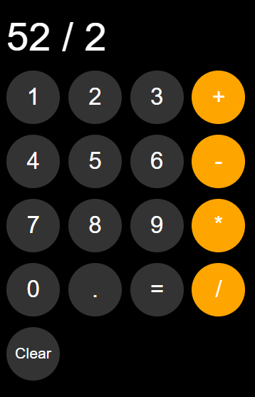
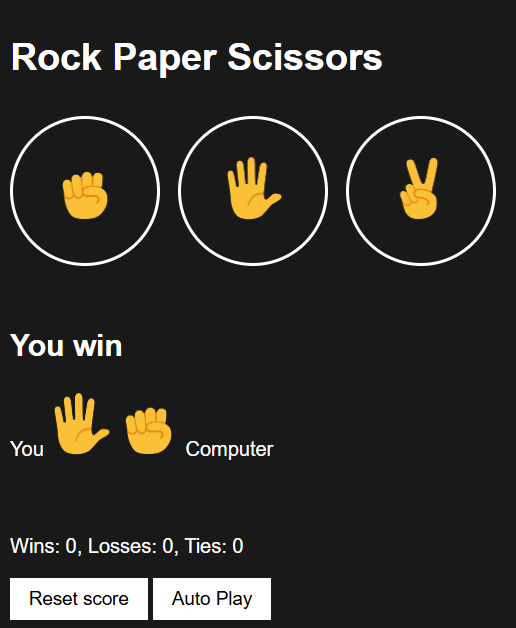
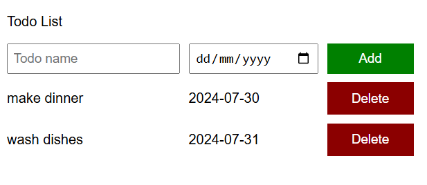

# JavaScript Projects

> This repository contains my first projects built during the summer of 2024 using **HTML, CSS, and JavaScript**. Each project helped me practice DOM manipulation, event handling, responsive design, and core JavaScript concepts.

---

## Projects Overview

### 1. Calculator App
A fully functional calculator that performs basic arithmetic operations.

**Features:**
- Addition, subtraction, multiplication, division  
- Clear button 
- Responsive layout   

---

### 2. Rock Paper Scissors Web App
Play Rock Paper Scissors against the computer with optional autoplay.

**Features:**
- Player vs computer gameplay  
- Reset and Autoplay buttons  
- Score tracking  
- Responsive UI  

---

### 3. To-Do List Web App
A task management app to add, complete, delete, and reset tasks.

**Features:**
- Add and delete tasks  
- Mark tasks as completed  
- Responsive design  

 

---

## Technologies Used Across Projects

- **HTML5** – for page structure  
- **CSS3** – for styling and layout  
- **JavaScript** – for interactivity and game/task logic  
- **DOM Manipulation** – dynamic updates and event handling  

---

These projects reflect my learning journey in JavaScript, from basic calculations and game logic to interactive task management. Each project demonstrates my ability to create responsive, interactive web applications with clean code.
